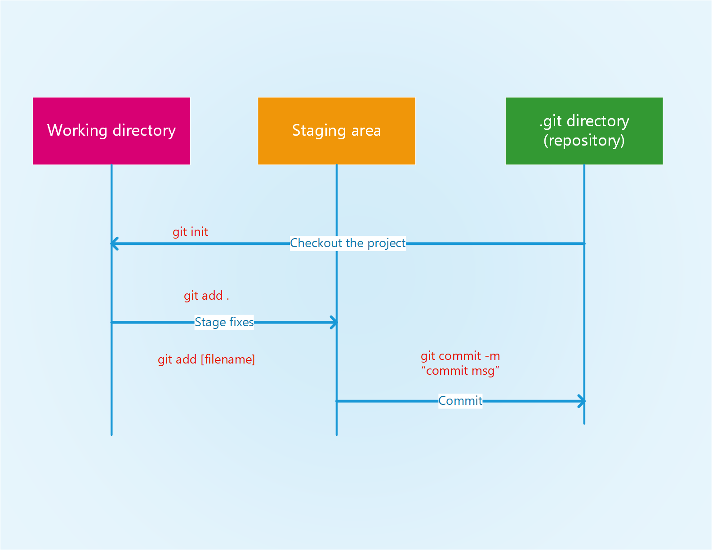

### LAB 1  

### TITLE: SOURCE CODE MANAGEMENT USING GIT  

### THEORY:
1. **Source code management/ Version control system(VCS)**
	
VCS is a system that records changes to a file or set of files over time so that we can recall specific version, revert selected files back to a previous state, revert the entire project back to previous state, compare changes over time and so on.

1. **Types of VCS**  
	1. **Local VCS:**
In local VCS user store different versions of file in local computer directory and each time major changes are made a whole new file is created and stored as another version. It is tedious and error prone.  
	RCS(Revision Control System) is an example of VCS, which is distributed if work with multiple computer. RCS keeps patch set (difference between files) and manages multiple revision of files.

	
	1. **Centralized VCS:**
In centralized VCS there is a single server system that contains all the version files. Administrator have fine control over project and it's distribution among members. Member can access and checkout files. It helps in collaboration between team members and they have knowledge about work progress. But it's downsize is that, it has a single point of failure i.e. if central system fails entire system fails and user may only have their single snapshot of file version in local system without access to central system. Similarly, if backup system is not created for central system then the file corruption can destroy whole version and system with no point of return. Example: CVS, Subversion, Perforce.
  
	
	1. **Distributed VCS:**
In distributed system, clone of working project with entire history of changes is mirrored from the working server or remote repository to the local repository. So, failure of repository can be compensated by restoring local repository back to server. DVCS provides various work flow for collaboration. It also provide efficient way for branching, merging, conflict resolution etc. which is very costly in other type of VCS. Example: Git, Bitkeeper, Mercurial, Bazaar or Darcs.

	  
1. **Git (DVCS):**  
	

	Other VCS systems treats the information as a set of files and the changes made to each file over time, which is also called delta-based version control.

	  

	Git thinks of its data more like a stream of snapshot i.e. git take a picture of what all your files looks like at that moment and stores a reference to that snapshot. For efficiency, the files without any changes are not stored again but only the link to the previous identical file it has already stored.  
	Some highlights of Git:
	1. Nearly every operation is local:  
	Most operation in Git needs only local file and resources to operate. You don't need connection to network computer, you can commit work on local system, browse the history of the project and so little you cannot do, which add great value and speed in professional work.
	1. Git has integrity:  
	In git everything is checksummed before storing and is then referred to by that checksum. So it is impossible to change the content without git knowing about it. It helps not to lose information during transit or get file corruption without git being able to detect it. The mechanism is called a SHA-1 hash, which is a 40-char string composed of hexadecimal char and calculated based on the contents of a file or directory structure. Git stores everything in its database not by file name but by the hash value of is contents.
	1. Git generally only adds data:  
	In git nearly every action is to add data to the git database. It is hard to get something undo able or to erase data if it is under git tracking. This makes us able to make experimentation without danger of severely screwing things up.
	1. The three states of git:  
	Git has three main states that your files can reside in: modified, staged, and committed:  
	- Modified means that you have changed the file but have not committed it to your database yet.
	- Staged means that you have marked a modified file in its current version to go into your next commit snapshot.
	- Committed means that the data is safely stored in your local database.
	
	This leads us to the three main sections of a Git project: the working tree, the staging area, and the Git directory.

	 

	- The working tree is a single checkout of one version of the project. These files are pulled out of the compressed database in the Git directory and placed on disk for you to use or modify.  
	- The staging area is a file, generally contained in your Git directory, that stores information about what will go into your next commit. Its technical name in Git parlance is the “index”.
	- The Git directory is where Git stores the meta data and object database for your project. This is the most important part of Git, and it is what is copied when you clone a repository from another computer.  

### CODE:
1. **Set-up**  
	Configuring user information used across all local repositories.  
	`git config --global user.name "[firstname lastname]"`  
	`git config --global user.email "[valid-email]"`

1. **Set-up and Initialization**  
	Initializing git, staging and committing.  
	**Initializing the git files:** `git init`  
	**Staging the changes:** `git add .` **or** `git add [file-name]`  
	**Committing the changes from staging state:** `git commit -m "[commit message]"`  
	**Checking current status of changes and staged files:** `git status`  
	**Checking committed changes and logs:** `git log` **or** `git log --oneline`  

1. **Update and share**  
	Adding remote repository, update and share  
	**Adding remote repo:** `git remote add [alias] [url]`  
	**Transmitting local repo branch commits to the remote repo:** `git push [alias] [branch]`  
	**Fetching all the branches from remote repo:** `git fetch [alias]`  
	**Cloning remote repo:** `git clone [url]`  