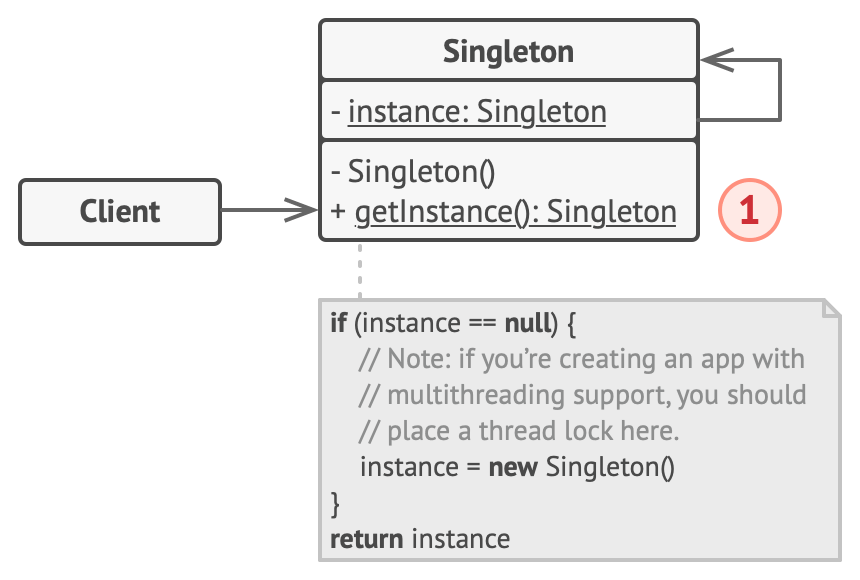
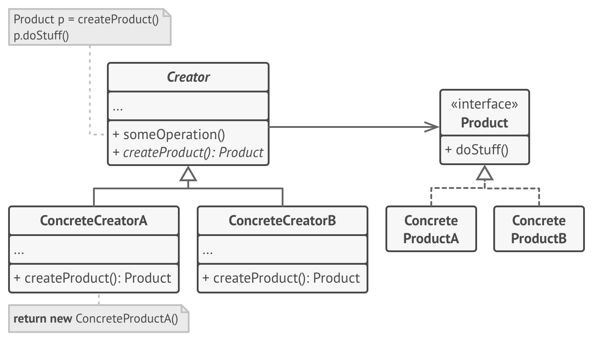

### LAB 3  

### TITLE: Implementing creation pattern: Singleton and Factory pattern  

### THEORY:
1. **Creation pattern**
	
In software engineering, creational design patterns are design patterns that deal with object creation mechanisms, trying to create objects in a manner suitable to the situation. The basic form of object creation could result in design problems or added complexity to the design. Creational design patterns solve this problem by somehow controlling this object creation.

	
Some of the creation pattern are:

	1. **Singleton Pattern**  
		1. **Intent**  
			- Ensure a class has only one instance, and provide a global point of access to it.
		1. **Problem**
			- Application needs one, and only one, instance of an object. Additionally, lazy initialization and global access are necessary.  
		1. **Solution**  
		

	1. **Factory Pattern**  
		1. **Intent**  
			- Define an interface for creating an object, but let subclasses decide which class to instantiate. Factory Method lets a class defer instantiation to subclasses.
		1. **Problem**
			- A framework needs to standardize the architectural model for a range of applications, but allow for individual applications to define their own domain objects and provide for their instantiation.
		1. **Solution**  
		

### CODE:
1. Singleton Pattern:
- [Singleton pattern code (early initialization)](./CreationPattern/Singleton/EarlyInitialization/Singleton.java)  
- [Singleton pattern code (lazy initialization)](./CreationPattern/Singleton/LateInitialization/LateInit.java)
1. Factory Pattern:
- [Factory pattern code](./CreationPattern/Factory/Factory.java)