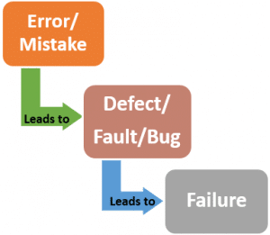

### Seven Testing principles:
1. **Testing shows presences of defects**
	
Testing can show that defects are present, but cannot prove that there are no defects. Testing reduces the probability of undiscovered defects remaining, but it is not a proof of correctness. Example: test cases are written considering different perspectives, so if the test cases mimics users’ behaviour then it find related types of defects.

1. **Exhaustive testing is impossible**
	
Testing everything is not feasible except for trivial cases. Instead of exhaustive testing, risk analysis and priorities should be used to focus testing efforts. Example:testing every test cases for log-in is not worth for testing efforts and business value.

1. **Early testing**
	
To find defects early, testing activities shall be started as early as possible in the software or system development life cycle, and shall be focused on defined objectives. Example: before integration if defects are found in a modules then this can prevent "domino effect".

1. **Defect clustering**
	
Testing effort shall be focused proportionally to the expected and later observed defect density of modules. According to the Pareto principle 80% of effects come from 20% of causes which means a small number of modules usually contains most of the defects discovered during pre-release testing, or is responsible for most of the operational failures. Example: due to complexity of a module most error in logic and code can lie there.

1. **Pesticide paradox**
	
If the same tests are repeated over and over again, eventually the same set of test cases will no longer find any new defects. To overcome this “pesticide paradox”, test cases need to be regularly reviewed and revised, and new and different tests need to be written to exercise different parts of the software or system to find potentially more defects. Example: like every lock have different key to open, every new defects have its own test cases to discover.

1. **Testing is context dependent**
	
Testing is done differently in different contexts. For example, safety-critical software is tested differently from an e-commerce site.

1. **Absence-of-errors fallacy**
	
Finding and fixing defects does not help if the system built is unusable and does not fulfil the users’ needs and expectations. Example: in a POS system logging-in is not objective of the cashier, his/her objective is to make a successful sale transaction.

### Entry and Exit criteria:
1. **Entry Criteria:**
	1. Availability of the test environment supporting hardware, software, network configuration tools.
	1. Availability of test data.
	1. Requirements and test cases priorities are set
	1. Test Design and documentation plans.
	1. Deciding exit criteria. 
1. **Exit criteria:**
	1. All planned test cases are executed.
	1. Sufficient coverage of the requirements and functionalities has been achieved
	1. High risk area has been tested.
	1. Time, budget and business interests are fulfilled.
	1. Writing and reporting logs.

### Importance of Testing in IT and non IT fields:
1. Risk identification and prevention increases the reliability and reduces the possibility of failures while in operation.  
Example: Pressure testing of tires mitigates risk of tire bursting while driving.
1. To measure the quality of product. Metrics of quality can be provided to stakeholders, satisfying their quality standards.
Example: Water and splash resistance test of smart phones under given water depth and time.
1. To merge experiences, facts, number and result for better product. Such results helps to evolve the product.
Example: Microprocessor has moves towards microscopic level with even faster and greater performance like: from Amd's 14 nanometre 2000 series chip to newer 7 nanometre 3000 series chip-set. 

### Causes of the software to have defects in them:
1. Shortcomings during requirement analysis and modelling can cause confusions among developers.
1. Code structure and complexity can cause entanglement, typo error, misplacement and missing code etc.
1. Test plans and cases might not cover some aspects and factors causing defect in software.
1. Heterogeneity due to programming language, platform, frameworks, and so on can cause defects and incompatibility in software.
1. Environmental and physical causes like radiation, electromagnetic interference, power leakages and so on can introduce errors in signals and data causing defects.

### Difference between between Error, Defect and Failure:
1. **Error:** The Error is a human mistake caused by logical mistake, misinterpretation, insufficient information, flaw in software design, mistake in requirement gathering, time pressure and other reasons.
1. **Defect:** An incorrect step, process or data definition in a computer program which causes the program to perform in an unintended or unanticipated manner. It is the result of error.
1. **Failure:** Failure is a consequence of a Defect. It is the observable incorrect behaviour of the system. Failure occurs when the software fails to perform in the real environment. Not all defects result in failures; some remain inactive in the code.   

### Retesting and regression testing:
1. **Retesting:**
	1. Ensure that the test cases which failed in last execution are passed after the defects are fixed.
	1. It is carried out based on defect fixes.
	1. For defect verification.
	1. Test cases that are failed in the prior execution are only re-executed.
	1. Test cases for retesting cannot be automated due to uncertainty.
	1. It has higher priority than regression testing.
	1. It is known as planned testing.
1. **Regression testing:**
	1. Ensure that changes have not affected the unchanged parts.
	1. It is not done for specific defect fixes.
	1. Defect verification is not it's part.
	1. Based on the project and availability of resources, it can be carried out parallel with Re-testing.
	1. It is done for passed test to check the unexpected side effects.
	1. It can be automated.
	1. It is known as generic testing.

### Mindset of developer and a tester:
1. **Developer mindset:**
	1. Mindset of developer "How can I make it?"
	1. They analyse and model the requirements to find best solutions and approaches possible to complete the task.
	1. They decides the programming language, frameworks, technology and functionalities of the software.
	1. They only perform some unit testing.
	1. They have limited flow path for test cases but multiple approaches towards solving.
	1. They debug and patch the defects logged by tester.
1. **Tester mindset:**
	1. Mindset of "How can I break it?"
	1. They create Test plans, Test strategies and understand the scope of the application.
	1. They test the application rigorously on different environments and checks the overall application’s performance and functionalities.
	1. Testers start testing with the mindset that the product might be faulty and need to be thoroughly tested before providing testing sign-off.
	1. Any defects that arose during the testing are logged in a defect tracking tool.
	1. Then automation scripts are created to reduce the manual overhead.
	1. Regression testing and retesting are performed to ensure a well-built product delivery.

### "Career in Testing in Nepal":
Testing or SQA carrer in Nepal has high possibility with following reasons:
1. Does not need alot of resources and budget, unlike a startup or building a project.
1. For similary projects same testing components can be reused which makes it less costly and less resource intensive job.
1. Testing is always a requirement for quality, so basically it is less competative or has lower risk than losing a client for a project.
1. Testing is a independent acitvity. So it can be assigned to individual tester and company thus has high market demand.
